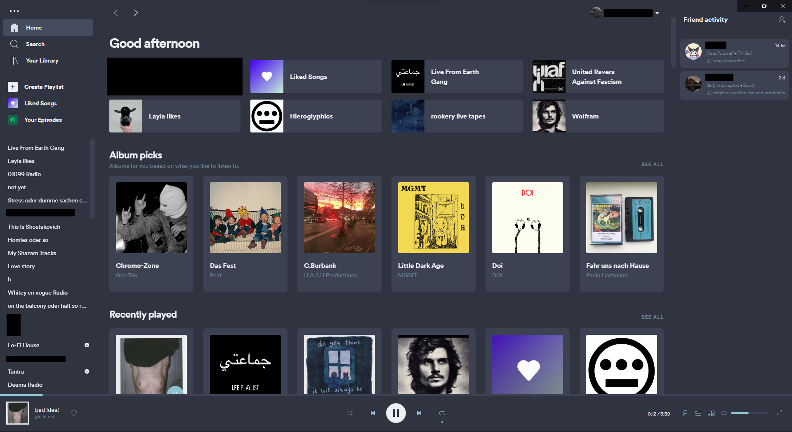

``━━━━━━━━━━━━━━━━━━━━━━━━━━━━
┏┓━┏┓━━━━━━━━━━━┏━┓━━━━━━━━━
┃┃━┃┃━━━━━━━━━━━┃┏┛━━━━━━━━━
┃┃━┃┃┏┓┏┓┏┓┏┓┏┓┏┛┗┓┏┓┏━━┓┏━┓
┃┃━┃┃┃┗┛┗┛┃┃┃┃┃┗┓┏┛┣┫┃┏┓┃┃┏┛
┃┗━┛┃┗┓┏┓┏┛┃┗┛┃━┃┃━┃┃┃┃━┫┃┃━
┗━━━┛━┗┛┗┛━┗━━┛━┗┛━┗┛┗━━┛┗┛━
━━━━━━━━━━━━━━━━━━━━━━━━━━━━``

### A slightly changed, nord-themed version of the really nice [Ziro spicetify Theme](https://github.com/schnensch0/ziro) by schnensch0

(consider actually opening the readme file for a higher definition preview)

### The most significant changes are the following:

- Changes on certain colors for visibility:
  - scrollbars have a different color
  - Text on certain seleted elements has a different color
  - 'Unused' part of the timline has a different color
- Removed Podcast section from homepage. They can still be acessed via the sidebar and search. 

for any support please just go and use the original repository and the info that comes with it as this fork is only developed for the `nord` theme (in `colors.ini`) and for my specific setup. If you feel like using this nontheless any feedback or contribuation is encouraged!
